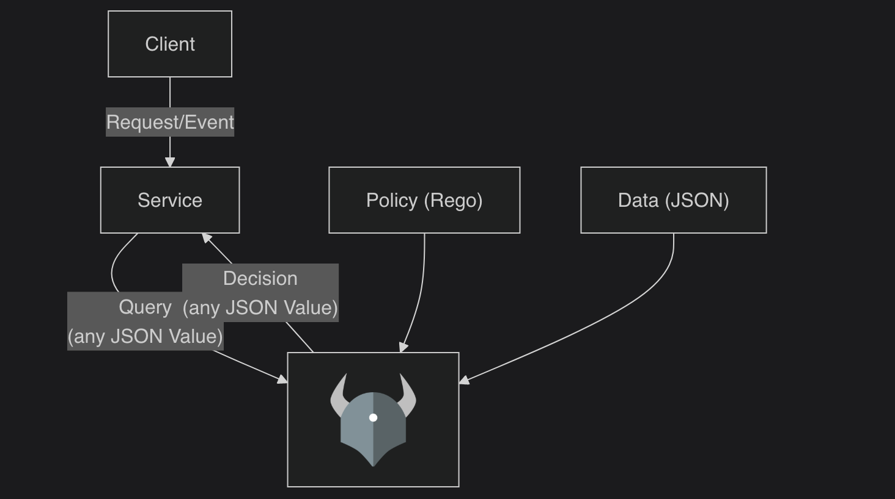

# OPA and Rego Introduction

Policy as Code with Open Policy Agent

---

# Table of Contents

1. What is OPA?
2. OPA architecture
3. What is OPA policy?
4. Input and data
5. Basic policy example in Rego
6. Using OPA from the CLI
7. Running OPA as a server
8. Where can we use OPA?
9. Summary

---

# OPA architecture



---

# What is OPA?

- OPA is an open source, general-purpose policy engine
- Services send structured input to OPA and receive policy decisions
- OPA evaluates input against policy and data
- It can return booleans, lists, objects, and other structured results

---

# What is OPA policy?

- OPA policy defines the rules used to make decisions
- A policy can return results such as `allow`, `deny`, or violation messages
- OPA policies are written in Rego
- Rego is the language for describing what should be true in the policy

---

# Input and data

- OPA evaluates arbitrary structured data
- `input` is the data provided for the current decision request
- `data` is the document space for loaded data and policy results
- OPA evaluates policy using the current `input` and available `data`
- Policy rules can produce results that are visible under `data`

---

# Input and data example

- In practice, `input` is often passed as JSON in CLI or HTTP requests
- `data` is commonly loaded from policy bundles or data files

Example input

```json
{
    "user": {
        "name": "alice",
        "role": "admin"
    },
    "action": "read",
    "resource": {
        "type": "document",
        "owner": "team-a"
    }
}
```

- In this example, the JSON value would be available as `input`
- A policy can read existing values from `data`, such as roles or ACLs
- A policy rule can also produce a result that is queried from `data`

---

# Basic policy example in Rego

```rego
package example.authz

default allow := false

allow if {
  input.user.role == "admin"
}
```

- This Rego module defines policy in the `example.authz` package
- OPA evaluates this policy with `input.user.role`
- The result of the `allow` rule is visible as `data.example.authz.allow`
- `default allow := false` defines the default decision
- `input.user.role` reads from the input document
- This policy returns `true` only for admin users

---

# Using OPA from the CLI

Install

```bash
brew install opa
opa version
```

Evaluate a policy

```bash
opa eval -d examples/authz.rego -i examples/input-admin.json "data.example.authz.allow"
```

- Use `-d` to load policy or data
- Use `-i` to pass input
- Good for local testing and CI

---

# Running OPA as a server

Start server

```bash
opa run --server examples/authz.rego
```

Query allow decision

```bash
curl localhost:8181/v1/data/example/authz/allow \
  -H 'Content-Type: application/json' \
  -d '{"input": {"user": {"name": "alice", "role": "admin"}, "action": "read"}}'
```

- Request body wraps the value inside `{ "input": ... }`
- Good for application integration

---

# Where can we use OPA?

- Microservices authorization
- Kubernetes admission control
- Infrastructure policy validation for tools like Terraform


---

# Summary

- OPA is a general-purpose policy engine
- OPA policy defines the decision logic
- Rego is the language used to write OPA policies
- OPA evaluates policy using `input` and `data`
- Policy results can be queried under `data`
- You can use OPA from the CLI or run it as a server
- This makes policy reusable and testable

---

# Official docs used for this deck

- What is OPA / use cases / running OPA: https://www.openpolicyagent.org/docs
- Policy concepts and document model: https://www.openpolicyagent.org/docs/philosophy
- Rego language basics and rule syntax: https://www.openpolicyagent.org/docs/policy-language
- `opa eval` command and flags: https://www.openpolicyagent.org/docs/cli#eval
- `opa run --server` command and flags: https://www.openpolicyagent.org/docs/cli#run

---

# Thank you!
